# Iron Grill AI Ordering App

Full-stack food ordering app with AI-powered conversational ordering.

## Tech Stack
Frontend: React Native (Expo), Zustand  
Backend: Node.js, Express, OpenAI API

## Features
- AI conversational ordering
- Cart management
- Promotions system
- Real-time order parsing

## Running the Project

### Client
npm install
npx expo start

### Server
npm install
node index.js

##### Screenshots

### Home Tab
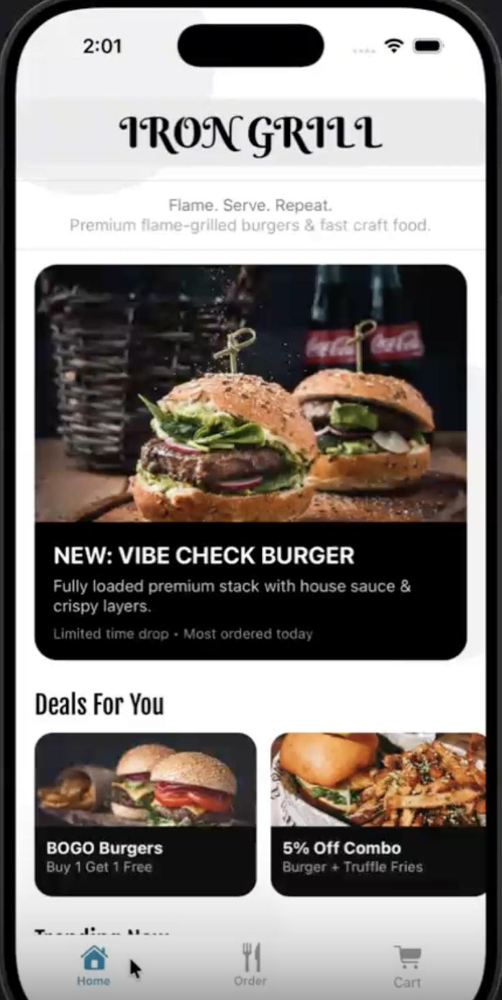
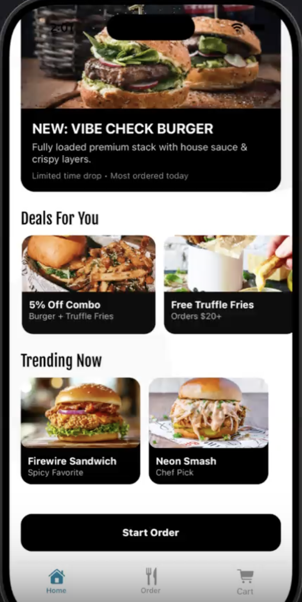

### Ordering Tab
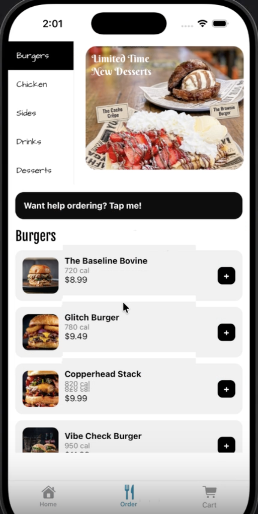
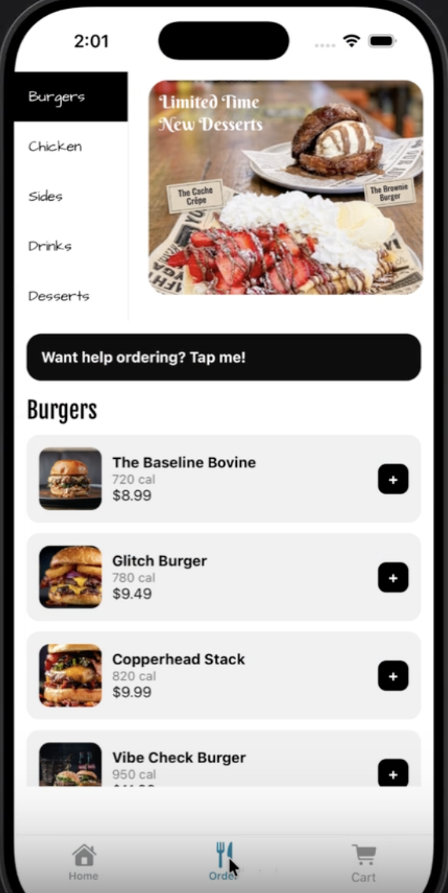
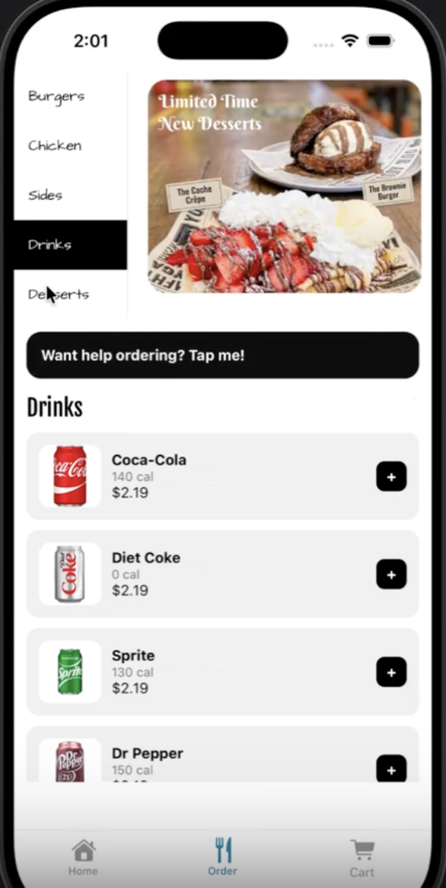
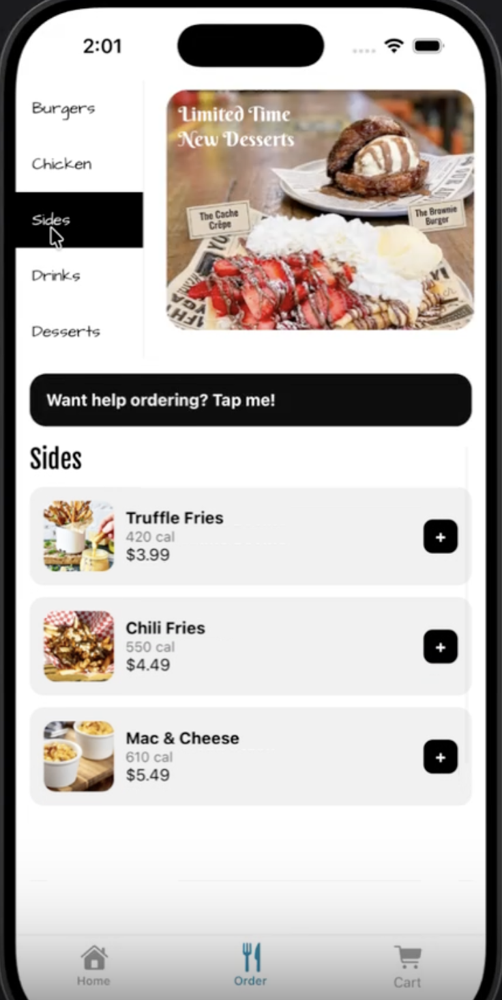
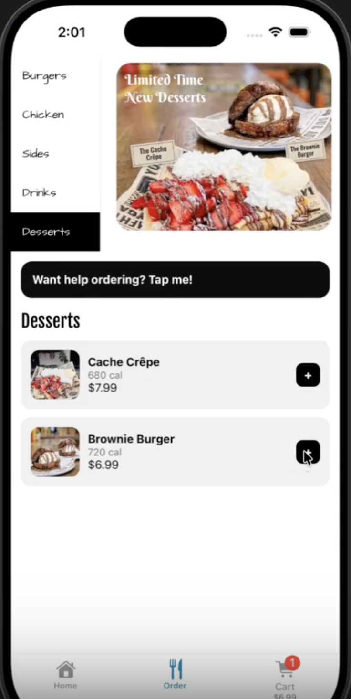

### Your Cart Tab
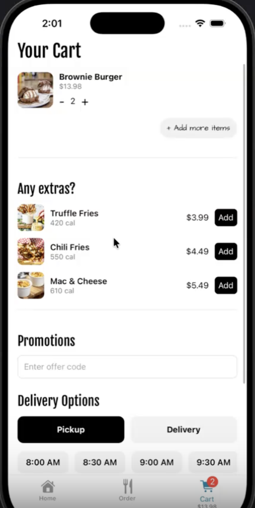
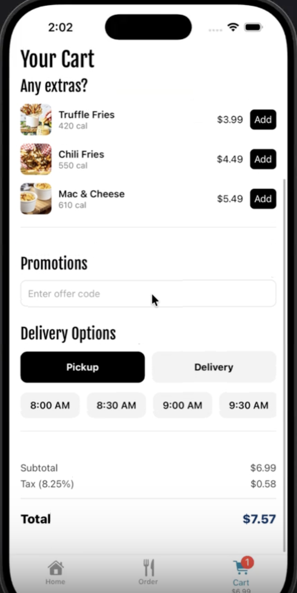

### AI Chat
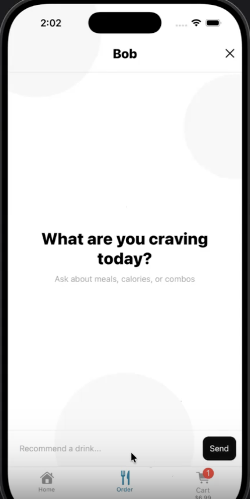
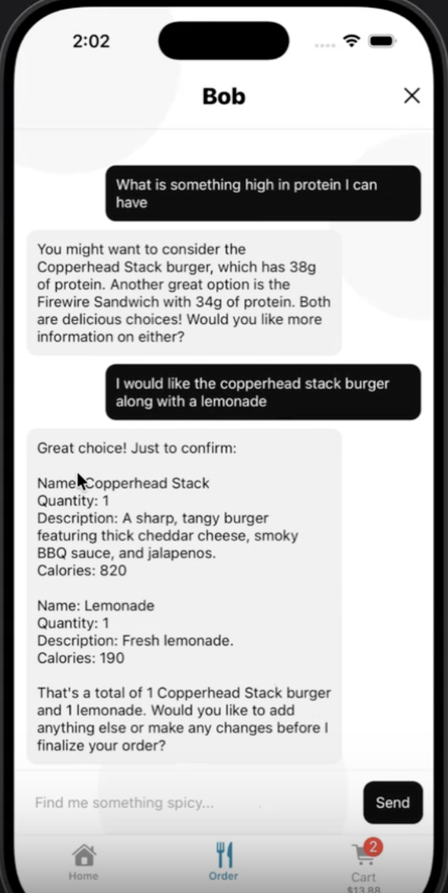
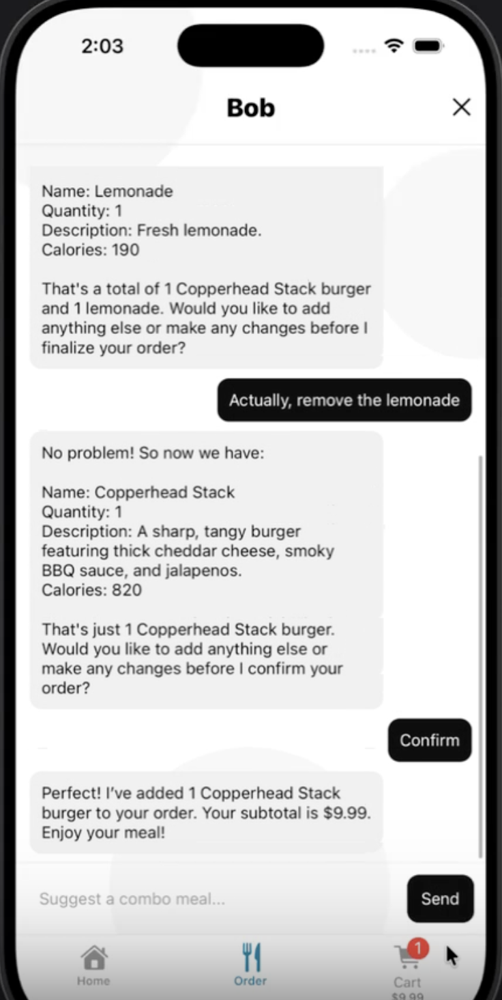